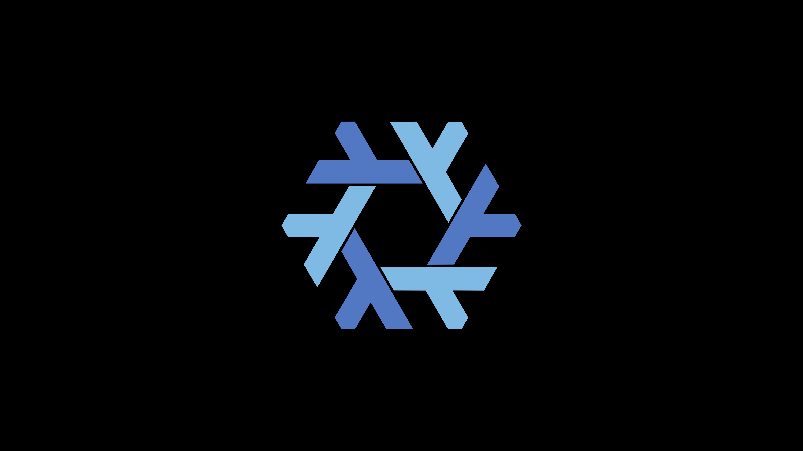

# SolOS

Fiat Lux!

## About

This is my NixOS configurations for multiple computers includes user space, server and dev boards.

For now, I'm trying to combine the blazing fast & smooth experience of niri window manager and the power of BMI EEG sensor, to cover all the basic operations in OS interaction, Gaming and even more.

Full WSL support, custom installation image and KDE support for researchers to run nix packed softwares are WIP too.

## Default System & Desktop environment

- System & Kernel: NixOS & Linux Zen
- Terminal: Kitty & Fish
- Window Manager: Niri & Astal shell
- App Launcher: Fuzzel
- Editor: Nixvim & Code

## Installation
<details>

<summary>To Directly install on your machine:</summary>

1. Download & install [NixOS](https://nixos.org/download/) on your machine, minimal ISO image preferred if you are familliar with linux CLI


2. Clone this and get in the repo:
```console
$ git clone https://github.com/Solhvemjsun/SolOS
$ cd SolOS
```


3. Copy the template folder in /devices for your device, user, and cusomization settings
```console
$ cp -r ./devices//template ./devices/<hostName>
$ cp /etc/nixos/hardware-configuration.nix ./devices/<hostName>/hardware-configuration.nix
```


4. Add the entry of your device with the required modules in the flake.nix using the simmilar format as other entries
```console
$ nvim fake.nix
```


5. Switch to the SolOS config
```console
$ sudo nixos-rebuild switch --flake .#DarkSol
```


6. Or install with the config you need in flake.nix:
```console
$ sudo nixos-install --root /mnt --flake .#<hostName>
```
</details>

<details>
<summary>To Install as WSL on Windows:</summary>

1. Enable WSL in your Windows PowerShell runned as Administrator:
```console
wsl --install --no-distribution
```


2. Download the prebuilt tarball [WIP] from the releases page in this repo


3. Double click the file you just installed to start the installation of it


4. You can now run NixOS from the windows PowerShell using:
```console
wsl -d NixOS
```
</details>

## Update
In the directory:
For NixOS:

```console
$ cd SolOS
$ make
```

For WSL:
```console
sudo nixos-rebuild boot [or related NH command in]
```

For nix-on-droid app:
```console
$ cd SolOS
$ nix-on-droid switch --flake .
```

## Build your customized installer

### Build the drive .iso image for installation

[WIP]

### Build the WSL tarball
```console
sudo nix run .#nixosConfigurations.SolOS-WSL.config.system.build.tarballBuilder
```

## Wallpaper

### NixOS

<figure>
    
    <figcaption>
        <p>
            Classical and minimalist NixOS logo.
        </p>
    </figcaption>
</figure>

## Future steps

### Brain-Machine-Interface

OpenBCI interaction for niri window manager

### EZ deploy & use

Clear structure and i18n documentation;

Modularize, multiple DE/WM support, customization modules;

### Blackhole Wallpaper

Use Real-time-simulated Blackhole as wallpaper
